# CapStone Project

## Creating a repository for greenwood-library-website
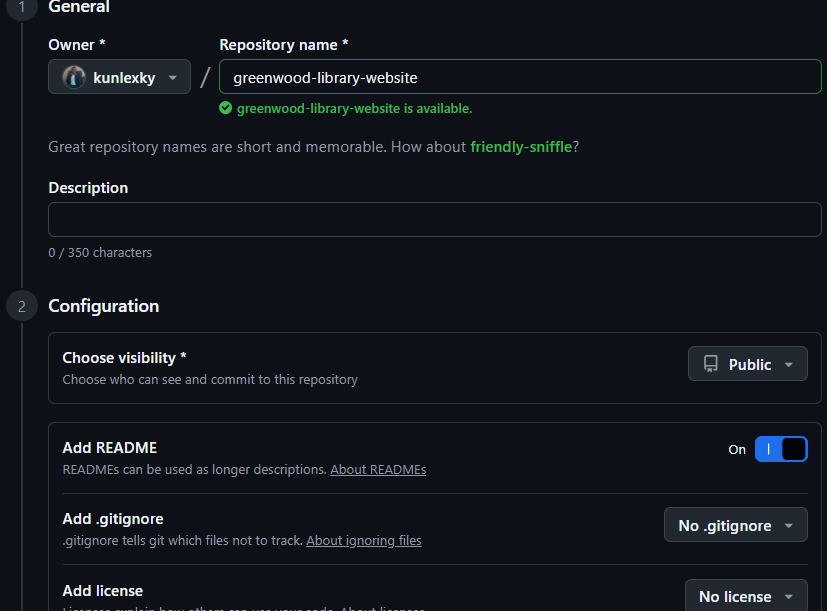

## Cloning the repository
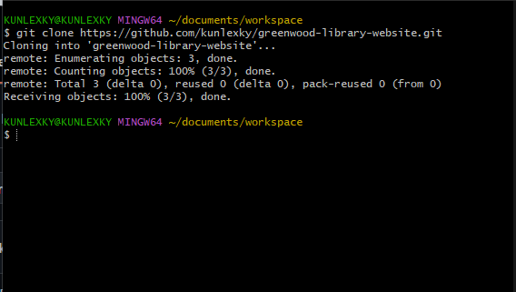

## Creating files
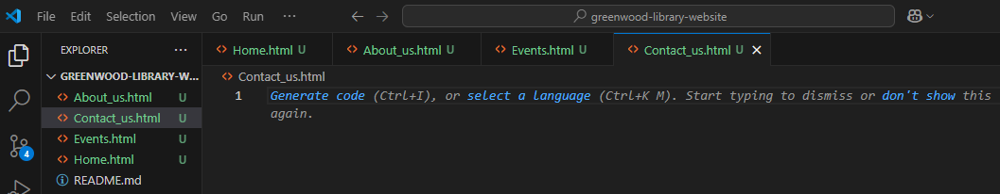

## Stage, Commit and pushing the files to main
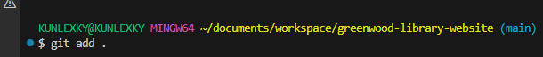
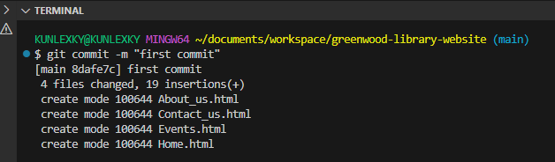
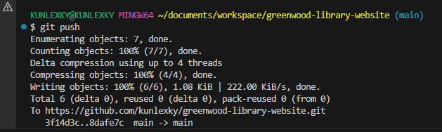

## Morgan's work
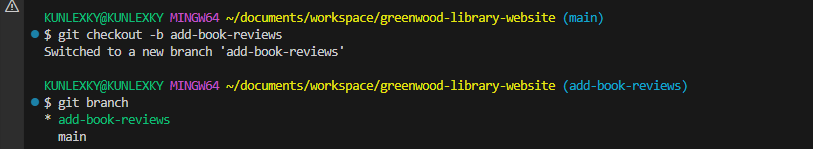

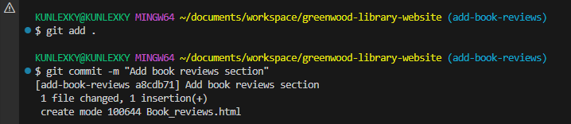

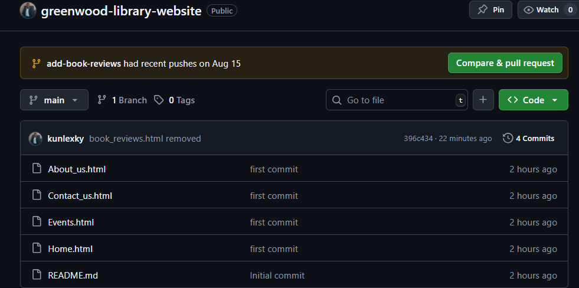

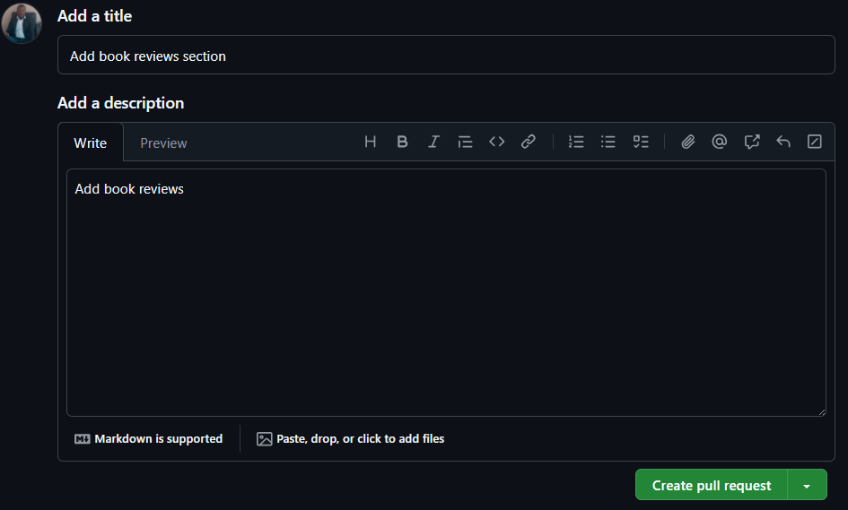

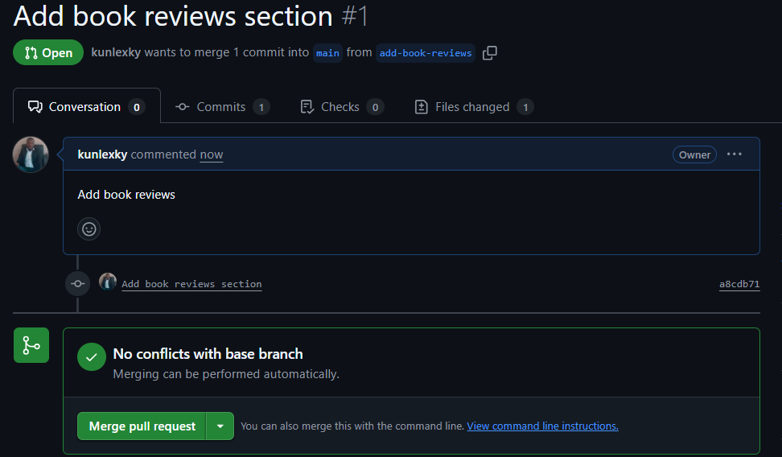

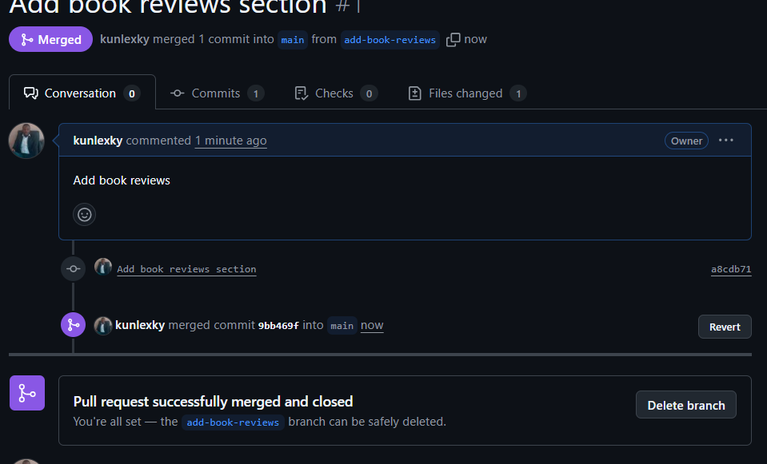

## Jaimie's work
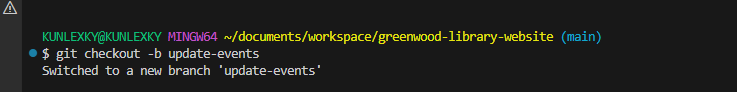

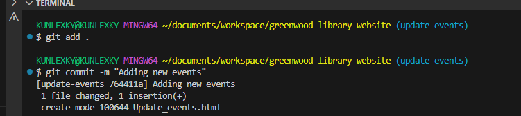
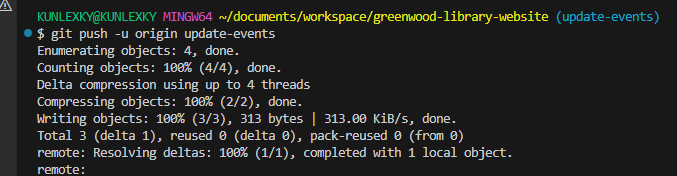

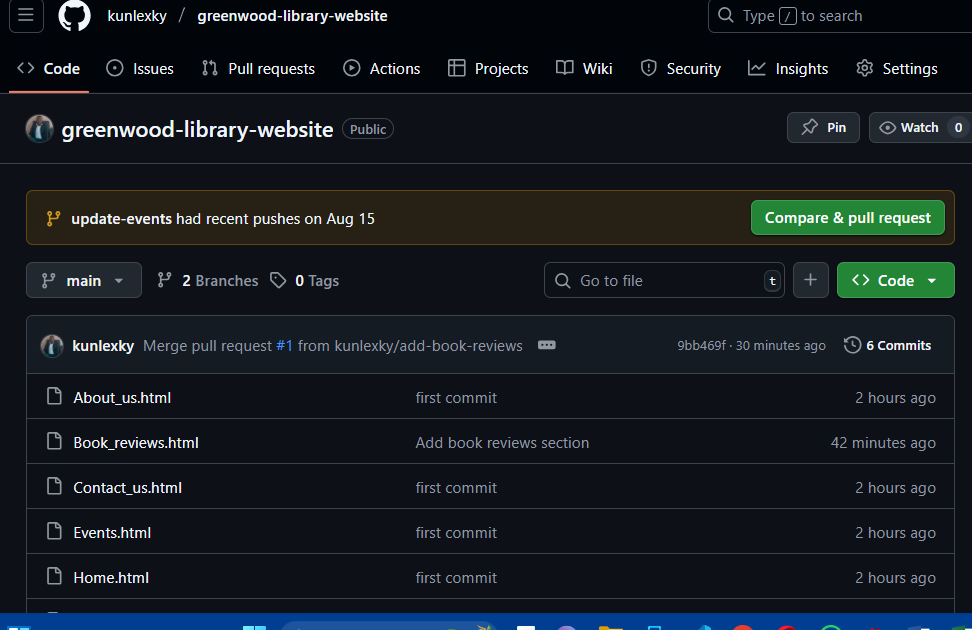

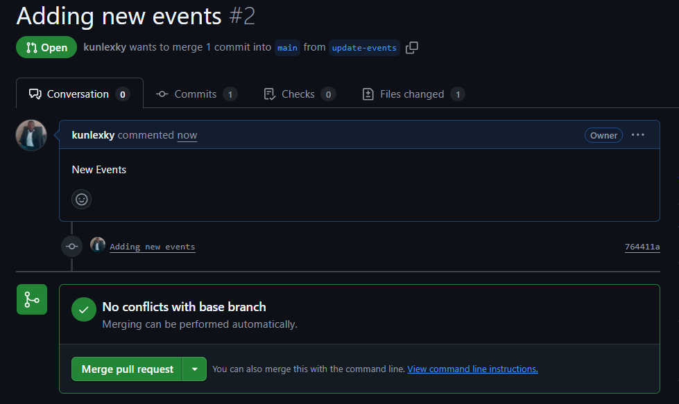

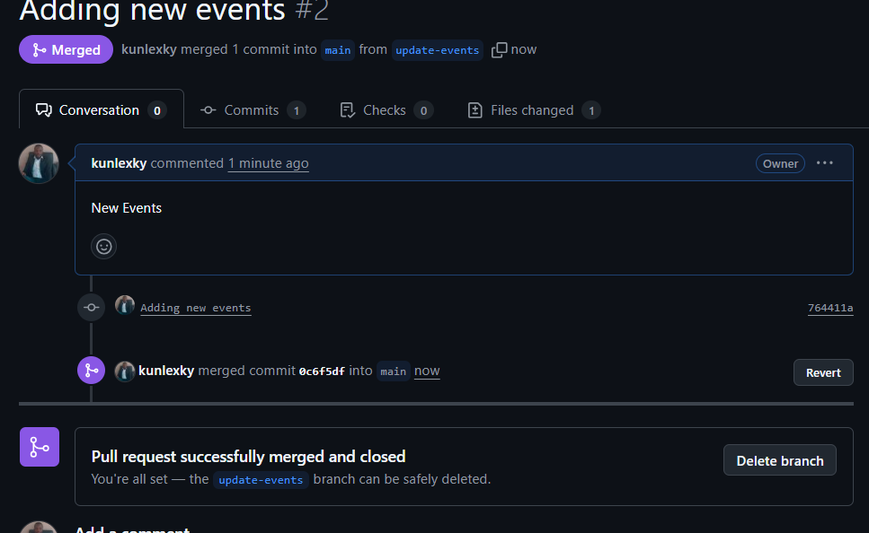